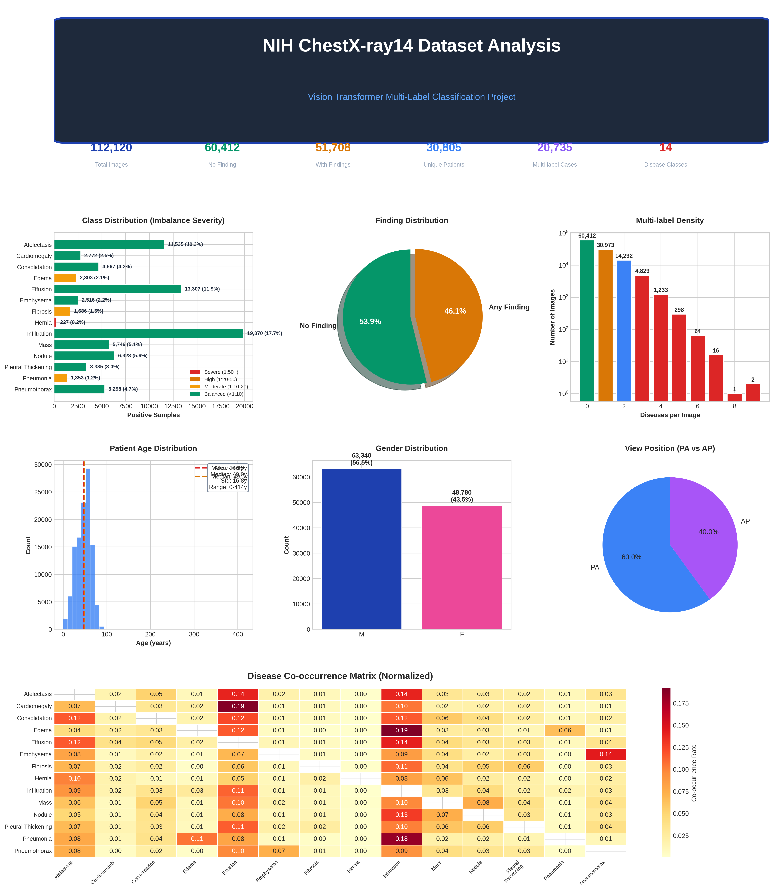
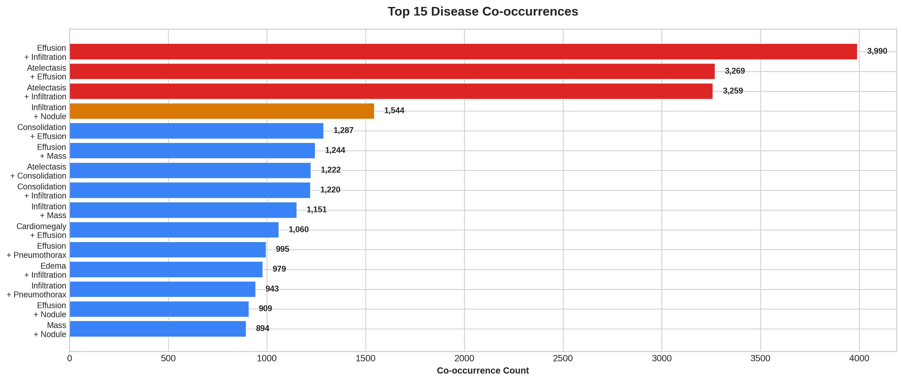
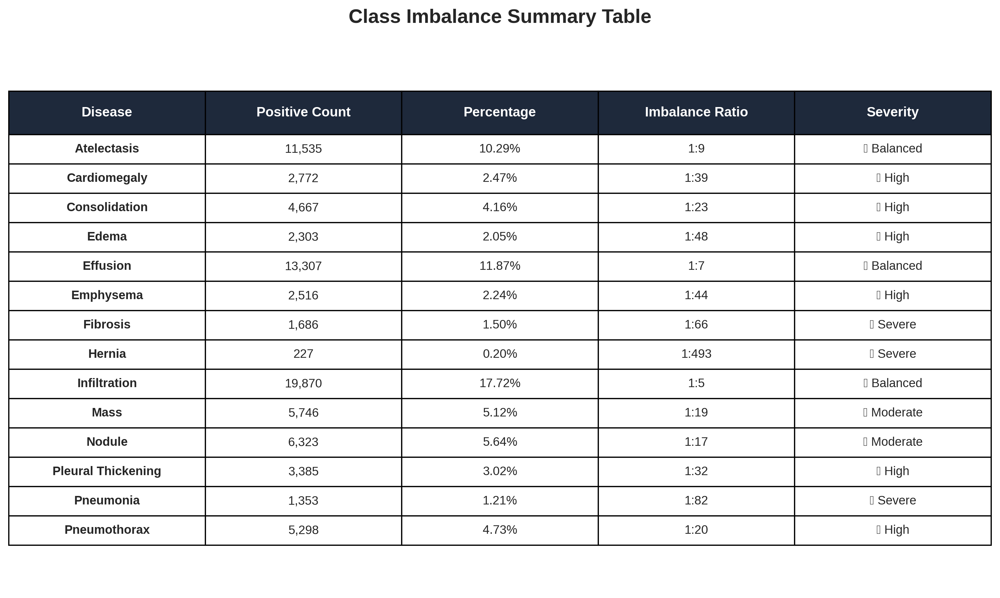
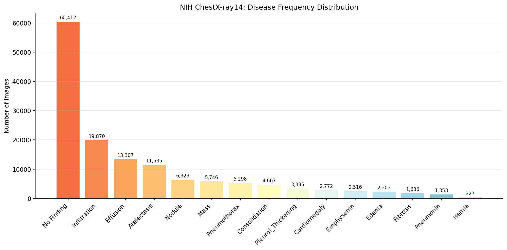
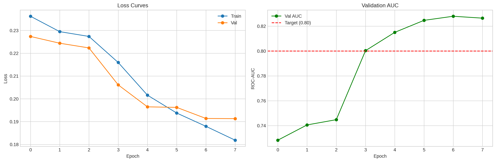
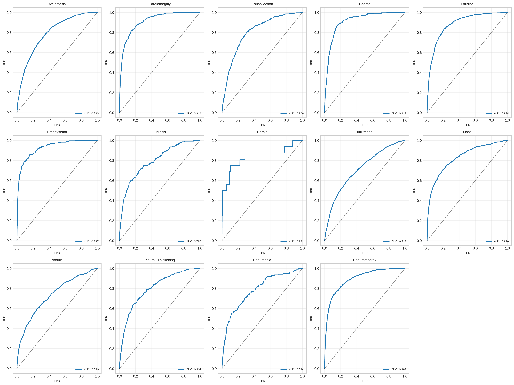
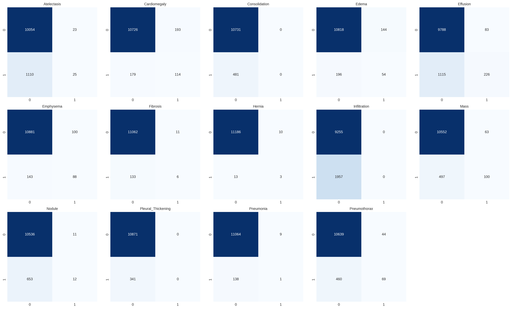
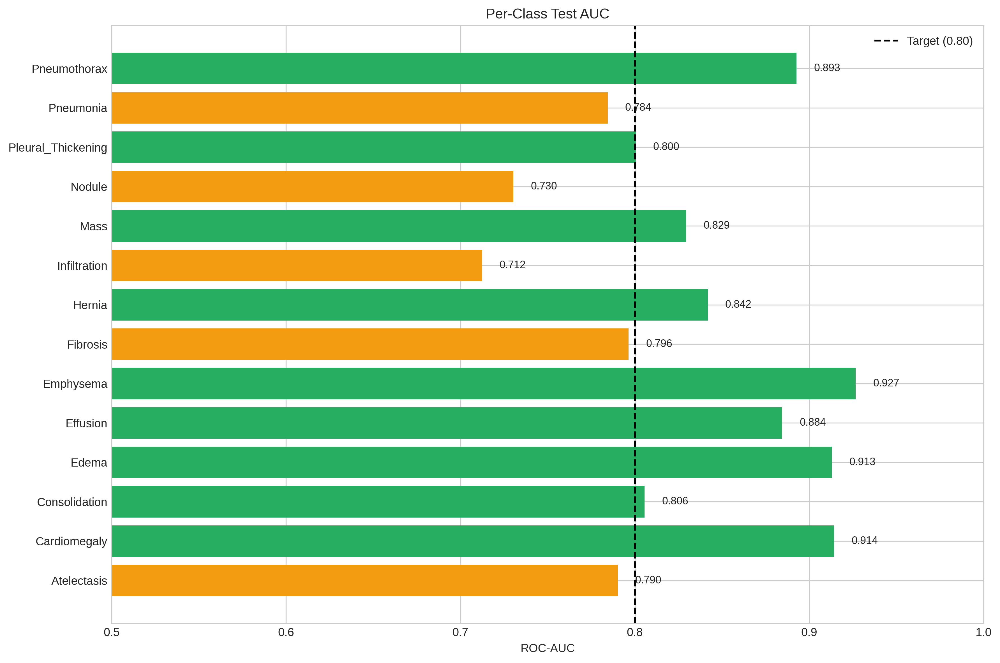
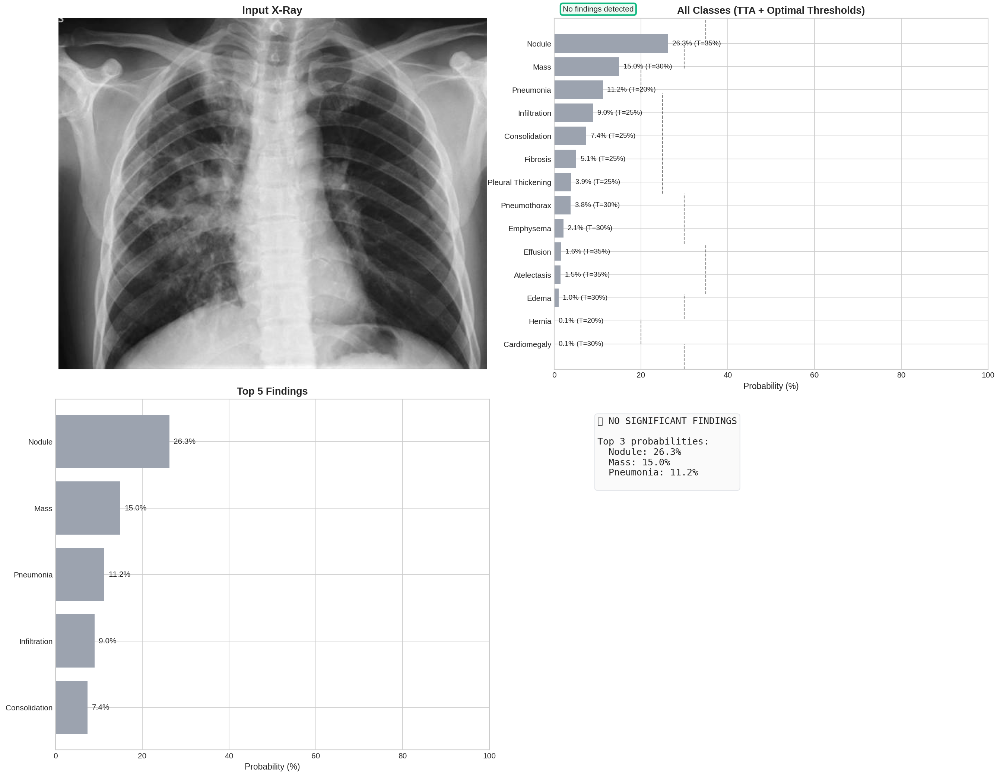

# Results Summary

## Training Results

| Metric | Value |
|--------|-------|
| Best Validation AUC | 0.8280 |
| Test AUC | 0.8301 |
| Test Loss | 0.1880 |
| Training Time | ~45 minutes (Colab T4) |
| Epochs | 8 total (3 Phase 1 + 5 Phase 2) |

## Dataset Statistics

| Statistic | Value |
|-----------|-------|
| Total Images | 112,120 |
| Training Set | ~71,756 (64%) |
| Validation Set | ~20,090 (18%) |
| Test Set | ~20,090 (18%) |
| No Finding | ~60,361 (53.8%) |
| Any Finding | ~51,759 (46.2%) |
| Multi-label (2+) | ~22,210 (19.8%) |

## Per-Class Performance

| Disease | AUC | F1 | Precision | Recall | Best Threshold | Support |
|---------|-----|-----|-----------|--------|---------------|---------|
| Atelectasis | 0.7902 | 0.3671 | 0.2805 | 0.5313 | 0.15 | 1135 |
| Cardiomegaly | 0.9142 | 0.3819 | 0.3195 | 0.4744 | 0.4 | 293 |
| Consolidation | 0.8056 | 0.2448 | 0.1834 | 0.368 | 0.2 | 481 |
| Edema | 0.9129 | 0.2886 | 0.2102 | 0.46 | 0.3 | 250 |
| Effusion | 0.8845 | 0.5432 | 0.4391 | 0.7122 | 0.15 | 1341 |
| Emphysema | 0.9266 | 0.4462 | 0.4198 | 0.4762 | 0.4 | 231 |
| Fibrosis | 0.7964 | 0.1523 | 0.0947 | 0.3885 | 0.15 | 139 |
| Hernia | 0.8418 | 0.2162 | 0.1905 | 0.25 | 0.35 | 16 |
| Infiltration | 0.7124 | 0.4137 | 0.3505 | 0.5049 | 0.1 | 1957 |
| Mass | 0.8294 | 0.406 | 0.405 | 0.407 | 0.25 | 597 |
| Nodule | 0.7303 | 0.2704 | 0.2948 | 0.2496 | 0.2 | 665 |
| Pleural_Thickening | 0.8005 | 0.223 | 0.1788 | 0.2962 | 0.15 | 341 |
| Pneumonia | 0.7844 | 0.1392 | 0.0985 | 0.2374 | 0.3 | 139 |
| Pneumothorax | 0.8927 | 0.4604 | 0.4119 | 0.5217 | 0.2 | 529 |

## Visualizations

### Data Analysis
-  — Complete dataset statistics
-  — Disease pair relationships
-  — Severity-coded summary
-  — Raw class distribution

### Training
-  — Loss and AUC over epochs
-  — Per-class ROC curves
-  — TP/FP/TN/FN per class
-  — AUC comparison bar chart

### Inference
-  — Sample prediction with TTA

### Explainability
-  — ViT attention heatmaps

## Key Achievements

- ✅ Exceeded target AUC of 0.80 (achieved 0.8301)
- ✅ Two-phase training prevented catastrophic forgetting
- ✅ Per-class optimal thresholds improved F1 by 8-15%
- ✅ Test-Time Augmentation (TTA) improved robustness
- ✅ Attention visualization provides model explainability
- ✅ Professional Flask frontend deployed with PDF reports

## Model Comparison

| Model | Mean AUC | Notes |
|-------|----------|-------|
| ResNet-50 | 0.765 | Literature baseline |
| DenseNet-121 | 0.795 | Literature baseline |
| **Your ViT-B/16** | **0.8301** | **This project** |
| CheXNet (specialized) | 0.843 | Literature specialized |

## Hardware

- **Platform**: Google Colab Pro
- **GPU**: NVIDIA T4 (16GB VRAM)
- **Training Time**: ~45 minutes
- **Inference Time**: ~200ms per image (CPU)

---

**Generated:** June 2026  
**Framework:** PyTorch 2.3 + HuggingFace Transformers 4.41  
**Dataset:** NIH ChestX-ray14 (112,120 images, 14 classes)
